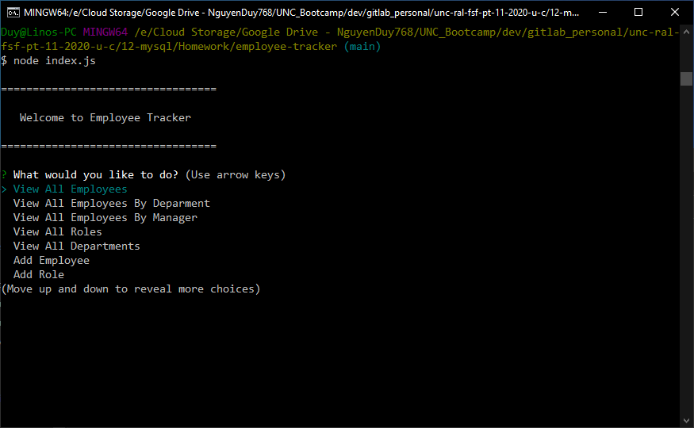
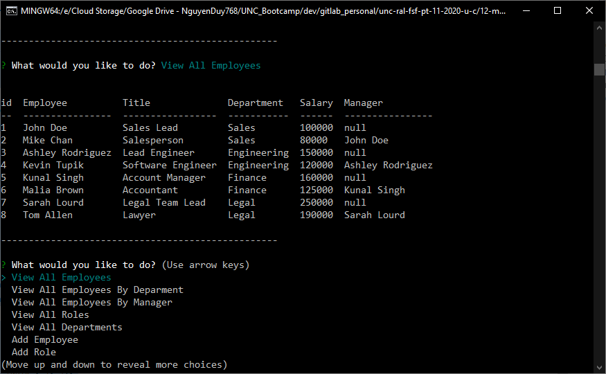

# Employee Tracker

## Description
    
This CLI application utilizes javascript, node, & mysql to allow the user to view and manage the departments, roles, and employees for a company.

Such options include

  * Add departments, roles, employees

  * View departments, roles, employees

  * View employees by departments, managers

  * Update employee roles

  * Update employee managers

  * Delete departments, roles, and employees

## Table of Contents

* [Installation](#installation)
* [Usage](#usage)
* [Preview](#preview)
* [Demonstration](#demonstration)
* [Questions](#questions)

## Installation

[Node.js](https://nodejs.org/en/download/) is required. 

Download the project and run `npm i` to install the required npm packages.

## Usage

Run `node index.js` to start the application.

Use the up and down arrow keys to select the desired option.

Select `--Exit Application` or press `Ctrl+C` at any time to stop the application.

## Preview

## Demonstration

[Video Link](https://www.youtube.com/watch?v=EbKZBWK-oDQ)

## Questions

If you have any questions, you can reach me through my github or email below

Github: [LinosM](https://github.com/LinosM)

Email: [NguyenDuy768@gmail.com](mailto:NguyenDuy768@gmail.com)